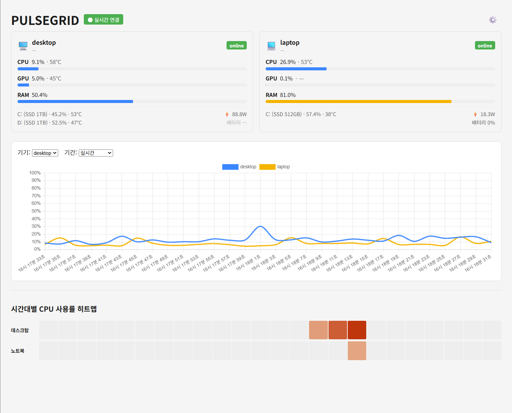
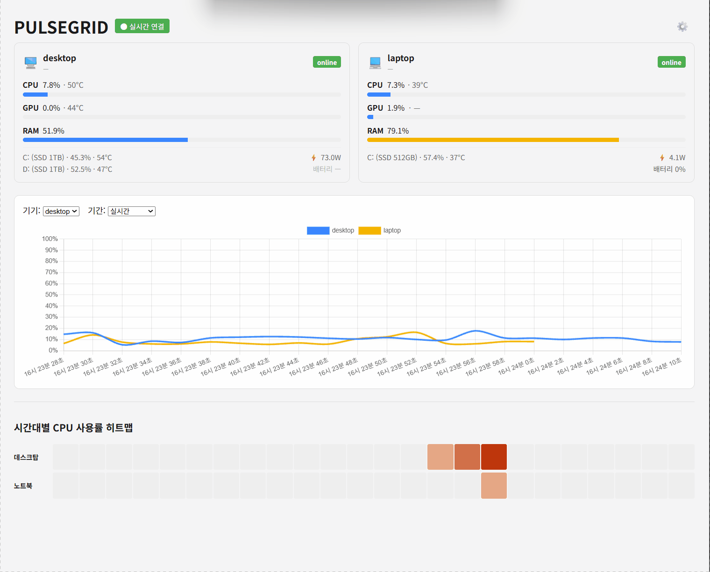
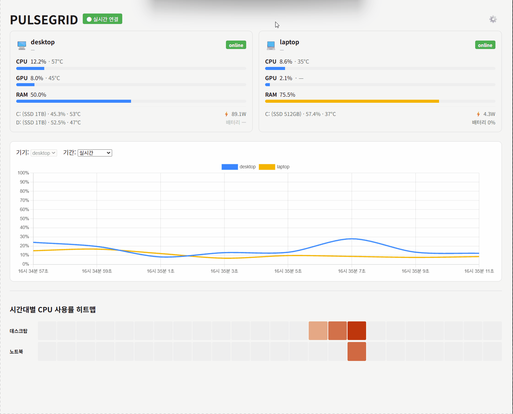
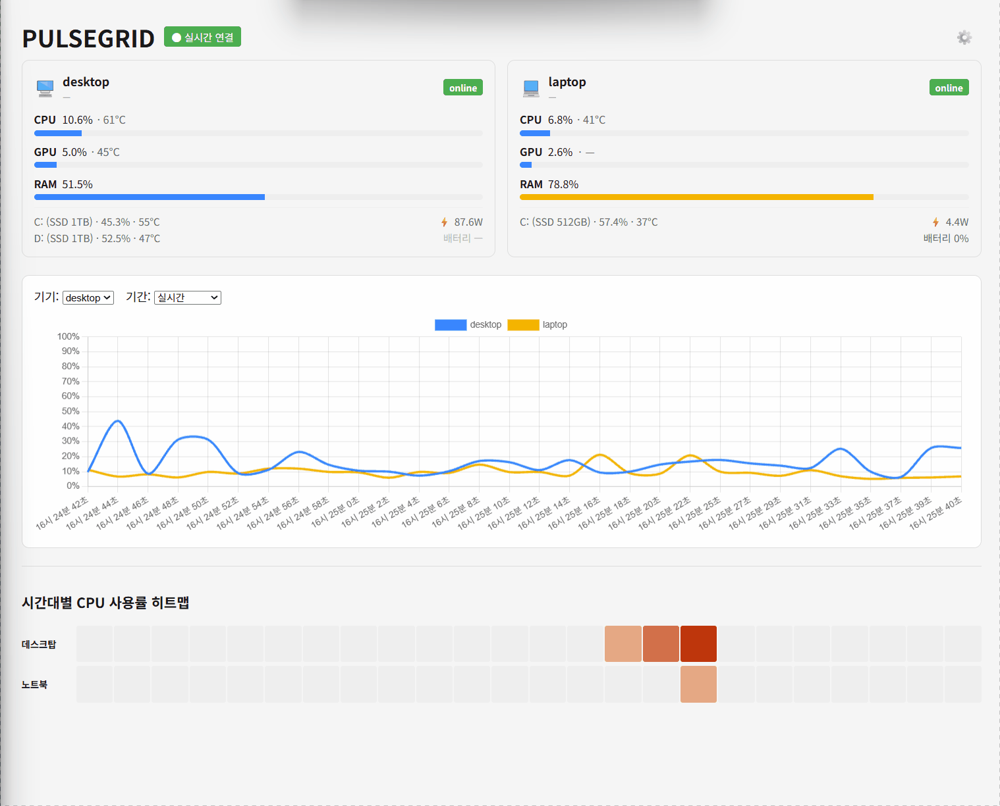

# PulseGrid

> 여러 대의 PC를 실시간으로 모니터링하는 웹 대시보드

노트북과 데스크탑처럼 사양이 서로 다른 여러 대의 PC의 CPU / GPU / RAM 상태를 한 화면에서 실시간으로 확인할 수 있는 개인용 모니터링 대시보드입니다.

> **v1.0 릴리즈 완료** — M1~M4(수집기, 서버, 다중 기기 연동, 대시보드) 완료
> **M5(히스토리 저장) 완료** — MariaDB 연동으로 과거 추이 조회 가능
> **M6(확장 지표) 완료** — 디스크(기기별 여러 개 대응) / 배터리 항목 추가
> **M6.5(시각화 확장) 완료** — 시간대별 CPU 히트맵, 실시간 전력(W) 표시, 라이트/다크 테마 전환
> **M7(문서화) 진행 중** — README/API 명세서 정리, 스크린샷 추가 예정





---

## 주요 기능

- **다중 기기 동시 모니터링** — 여러 대의 PC 상태를 한 화면에서 확인
- **실시간 갱신** — WebSocket 기반 2초 간격 자동 갱신
- **이기종 하드웨어 대응** — Intel / AMD / NVIDIA 등 제조사가 달라도 동일한 방식으로 수집
- **임계치 경고** — 온도 및 사용률이 기준을 넘으면 시각적으로 표시
- **반응형 대시보드** — 화면 폭에 따라 카드 열 수 자동 조절, 연결 끊김 시 자동 재연결
- **오프라인 감지** — 기기가 꺼지거나 연결이 끊기면 자동 감지

---

## 스크린샷 더 보기

<details>
<summary>히스토리 모드 (과거 데이터 조회)</summary>



</details>

<details>
<summary>라이트 / 다크 테마 전환</summary>



</details>

---

## 시스템 구조

```
┌───────────────┐   ┌───────────────┐
│    LAPTOP     │   │    DESKTOP    │ 
│               │   │               │
│ LibreHardware │   │ LibreHardware │ 
│    Monitor    │   │    Monitor    │
│       ↓       │   │       ↓       │
│   PulseGrid   │   │   PulseGrid   │
│     Agent     │   │     Agent     │
└──────┬────────┘   └──────┬────────┘
       │   HTTP POST (2s)  │
       └─────────┬─────────┘
                 ↓
       ┌────────────────────┐
       │  PulseGrid Server  │
       │     (FastAPI)      │
       └─────────┬──────────┘
                 │ WebSocket
                 ↓
       ┌────────────────────┐
       │    Web Dashboard   │
       └────────────────────┘
```

| 구성 요소 | 역할 |
|---|---|
| LibreHardwareMonitor | 하드웨어 센서 값을 JSON으로 제공 (외부 도구) |
| PulseGrid Agent | 각 기기에서 센서 값을 수집해 서버로 전송 |
| PulseGrid Server | 데이터 수신 및 실시간 브로드캐스트 |
| 웹 대시보드 | 브라우저에서 실시간 상태 표시 |

자세한 설계 내용은 [시스템 아키텍처 문서](docs/02_architecture.md)를 참고하세요.

---

## 기술 스택

| 구분 | 기술 |
|---|---|
| 센서 수집 | LibreHardwareMonitor |
| 수집기 | Python, `requests` |
| 백엔드 | Python, FastAPI |
| 실시간 통신 | WebSocket |
| 프론트엔드 | HTML, JavaScript, Chart.js |
| 데이터베이스 | MariaDB |

---

## 프로젝트 구조

```
pulsegrid/
│
├── agent/                           # 각 기기에서 실행되는 수집기
│   ├── agent.py
│   ├── config.example.desktop.json
│   └── config.example.laptop.json
│
├── server/                          # FastAPI 서버
│   ├── db_config.example.json
│   ├── db.py
│   ├── main.py
│   ├── models.py
│   └── schema.sql
│   
├── web/                             # 웹 대시보드
│   ├── index.html
│   ├── app.js
│   └── style.css
│
├── docs/                            # 설계 문서
│   ├── images/                      # 스크린샷 / GIF
│   ├── 01_requirements.md
│   ├── 02_architecture.md
│   ├── 03_api_spec.md
│   ├── 04_ui_design.md
│   ├── 05_milestones.md
│   └── DEVLOG.md
│
├── .gitignore
├── LICENSE
├── requirements.txt
└── README.md
```

> 구조는 개발 진행에 따라 변경될 수 있습니다.

---

## 시작하기

### 사전 준비

각 모니터링 대상 기기에 [LibreHardwareMonitor](https://github.com/LibreHardwareMonitor/LibreHardwareMonitor)를 설치하고 원격 웹 서버 기능을 활성화해야 합니다.

1. 최신 릴리즈에서 `LibreHardwareMonitor.zip` 다운로드 후 압축 해제
2. `LibreHardwareMonitor.exe`를 **관리자 권한으로 실행**
3. `Options → Remote Web Server → Run` 체크
4. 브라우저에서 `http://localhost:8085/data.json` 접속해 센서 데이터가 표시되는지 확인

### 데이터베이스 준비 (MariaDB)

1. [MariaDB](https://mariadb.org/download/) 설치 (또는 이미 있는 MariaDB 서버 사용)
2. **MariaDB Connector/C** 설치 — Python `mariadb` 패키지가 내부적으로 이 C 라이브러리를 필요로 함 (pip만으로는 설치되지 않음)
   - [Connector/C 다운로드](https://mariadb.com/downloads/connectors/connectors-data-access/c-connector) 후 설치
3. 터미널에서 `mysql --version`을 실행해 정상 동작하는지 확인
   - `mysql : 용어가 ... 인식되지 않습니다` 등의 오류가 뜨면, MariaDB 설치 경로의 `bin` 폴더(예: `C:\Program Files\MariaDB 12.x\bin`)가 시스템 PATH에 등록되지 않은 것입니다. 환경 변수 편집에서 직접 추가한 뒤 터미널을 새로 열어 다시 확인하세요.

### 설치 및 실행

1. 저장소 클론 후 `server/` 폴더로 이동

2. 가상환경(venv) 생성 및 활성화

```bash
   python -m venv venv
   venv\Scripts\activate
```

3. 의존 패키지 설치

```bash
   pip install -r requirements.txt
```

4. `schema.sql`을 실행해 데이터베이스와 테이블 생성

```powershell
Get-Content schema.sql | mysql -u root -p
```
   (`mysql -u root -p < schema.sql`는 cmd.exe/Git Bash에서는 동작하지만, **PowerShell에서는 `<` 리다이렉션이 지원되지 않아** 위 명령을 사용해야 합니다. HeidiSQL 등 GUI 툴로 `schema.sql` 내용을 그대로 실행해도 무방)

5. `db_config.example.json`을 같은 폴더에 `db_config.json`으로 복사 후, 본인 MariaDB 접속 정보로 수정

```json
{
    "host": "127.0.0.1",
    "port": 3306,
    "user": "root",
    "password": "YOUR_PASSWORD_IS_HERE",
    "database": "pulsegrid"
}
```

6. 서버 실행 (다른 기기에서도 접속할 수 있도록 `--host 0.0.0.0` 필수)

```bash
   uvicorn main:app --reload --host 0.0.0.0
```

7. 브라우저에서 `http://127.0.0.1:8000` 접속 확인

8. `agent/config.example.desktop.json`(또는 `.laptop.json`)을 본인 기기 종류에 맞게 `agent/config.json`으로 복사 후, 아래 안내에 따라 본인 환경에 맞게 수정

   **8-1. `server_url` — 서버가 실행 중인 기기의 IP 주소 확인**

   - 서버를 실행하는 그 기기(예: 데스크탑)에서 명령 프롬프트를 열고 다음을 입력:
```powershell
     ipconfig
```
   - 출력 결과에서 **"IPv4 주소"** 항목을 찾음 (예: `192.168.0.5`) — 보통 `192.168.x.x`나 `10.x.x.x` 형태
   - `agent/config.json`의 `server_url`에 이 주소를 사용: 
   ```
   "server_url": "http://192.168.0.5:8000/api/v1/metrics"
   ```

   > ⚠️ **주의**: `127.0.0.1`은 "이 컴퓨터 자기 자신"만 가리키는 특수 주소입니다. 서버와 같은 기기에서 agent를 돌린다면 `127.0.0.1`도 동작하지만, **다른 기기(노트북 등)에서는 반드시 서버 기기의 실제 IPv4 주소를 사용해야 합니다.** 두 기기가 같은 공유기(Wi-Fi)에 연결돼 있어야 서로 통신할 수 있습니다.
   >
   > 공유기 환경에 따라 IP가 재부팅 시 바뀔 수 있습니다. 연결이 갑자기 안 되면 서버 기기에서 `ipconfig`를 다시 확인하세요.

   **8-2. `device_name` — LibreHardwareMonitor에서 컴퓨터 이름 확인**

   - 브라우저에서 `http://localhost:8085/data.json` 접속
   - Chrome/Edge는 JSON을 자동으로 트리 구조로 예쁘게 보여줍니다. 맨 바깥 `Children` 배열을 펼치면 첫 번째 항목의 `"Text"` 값이 컴퓨터 이름입니다 (예: `"Text": "DESKTOP-5VSB06S"`)
   - `Ctrl+F`로 `"Text":"DESKTOP` 또는 `"Text":"LAPTOP` 처럼 검색하면 더 빠르게 찾을 수 있습니다
   - 이 값을 그대로 `device_name`에 복사

   **8-3. `sensor_map` / `disk_map` / `battery_sensor`의 SensorId 값 찾기**

   같은 `http://localhost:8085/data.json` 페이지에서, `Ctrl+F`로 아래 키워드를 검색해 해당 항목 바로 옆의 **`"SensorId"` 값**을 복사합니다.

   | 찾고 싶은 값 | 검색 키워드 | 비고 |
   |---|---|---|
   | CPU 전체 사용률 | `CPU Total` | Intel 기준. AMD는 `Core (Tctl/Tdie)` 등 명칭이 다를 수 있음 |
   | CPU 온도 | `CPU Package` | Temperatures 섹션 아래 있는 것 사용 |
   | CPU 소비전력 | `CPU Package` | Powers 섹션 아래 있는 것 — **위 온도용과 이름이 같으니 섹션 위치로 구분** |
   | GPU 사용률/온도/전력 | `GPU Core` 또는 그래픽카드 이름 | 그래픽카드 항목 아래 Load/Temperature/Power |
   | RAM 사용률 | `Memory` | "Total Memory" 항목 아래 것 사용 (Virtual Memory 아님) |
   | 디스크 사용률 | `Used Space` | 디스크(SSD/NVMe) 항목 아래 |
   | 디스크 온도 | `Temperature` | 같은 디스크 항목 아래 |
   | 배터리 잔량 | `Charge Level` | 노트북에만 존재 |

   찾은 항목의 `"SensorId": "/xxx/yyy/zzz"` 값을 그대로 복사해 config.json의 해당 자리에 붙여넣으면 됩니다.

   > ⚠️ 이 경로는 **CPU/GPU 제조사와 모델에 따라 완전히 다릅니다.** 예시 파일(`config.example.desktop.json`/`.laptop.json`)의 값은 작성자의 특정 하드웨어 기준이라 그대로 복사하면 동작하지 않습니다. 반드시 본인 기기의 `data.json`에서 직접 확인해야 합니다.

   - 다른 기기를 추가할 경우, 그 기기에서도 동일하게 `agent/` 폴더와 자신만의 `config.json`을 두고 실행

9. (별도 터미널) `agent/agent.py` 실행 → 대시보드에 CPU/GPU/RAM 값이 2초 간격으로 갱신되는지 확인

### 설정

`agent/config.json` (Git에 포함되지 않음, 각자 로컬에서 생성)

| 필드 | 설명 |
|---|---|
| `device_id` | 기기 고유 식별자 (예: `desktop`, `laptop`) |
| `device_name` | 대시보드에 표시될 이름 |
| `lhm_url` | LibreHardwareMonitor의 로컬 JSON 주소 |
| `server_url` | PulseGrid 서버 주소 (예: `http://<서버IP>:8000/api/v1/metrics`) |
| `disk_map` | 디스크별 SensorId 매핑 목록 (기기마다 디스크 개수가 달라 배열 구조) |
| `battery_sensor` | 배터리 잔량 SensorId (데스크탑은 이 필드 자체를 생략) |
| `sensor_map` | CPU/GPU/RAM 사용률·온도·전력 SensorId 매핑 |

---

## API 개요

| 메서드 | 엔드포인트 | 설명 |
|---|---|---|
| `POST` | `/api/v1/metrics` | 수집기 → 서버 지표 전송 |
| `GET` | `/api/v1/history` | 기기별 히스토리 조회 (`device_id`, `minutes` 쿼리) |
| `GET` | `/api/v1/heatmap` | 시간대별 CPU 히트맵 조회 (`hours` 쿼리) |
| `WS` | `/ws/dashboard` | 실시간 지표 수신 |

> `/api/v1/devices`, `/api/v1/health` 등은 설계 단계에서 검토했으나 실제로는 불필요해 미구현 상태입니다. 자세한 사유는 [API 명세서](docs/03_api_spec.md)를 참고하세요.

---

## 개발 로드맵

| 단계 | 내용 | 상태 |
|---|---|:---:|
| M0 | 환경 구성 | ✅ |
| M1 | 수집기 프로토타입 | ✅ |
| M2 | 서버 + 단일 기기 연동 | ✅ |
| M3 | 다중 기기 연동 | ✅ |
| M4 | 대시보드 완성 (**v1.0**) | ✅ |
| M5 | 히스토리 저장 | ✅ |
| M6 | 확장 지표 (디스크 / 배터리) | ✅ |
| M6.5 | 시각화 확장 (히트맵 + 전력 + 테마) | ✅ |
| M7 | 문서화 및 정리 | 🔄 진행중 |
| M8 | 외부 API 연동 (전국 전력수급) | ⬜ |

---

## 문서

| 문서 | 내용 |
|---|---|
| [요구사항 정의서](docs/01_requirements.md) | 기능 범위, 우선순위, 제약 조건 |
| [시스템 아키텍처](docs/02_architecture.md) | 전체 구조, 컴포넌트 역할, 기술 선택 근거 |
| [API 명세서](docs/03_api_spec.md) | 엔드포인트, 데이터 모델, WebSocket 규격 |
| [화면 설계서](docs/04_ui_design.md) | 레이아웃, 상태 표시 규칙, 반응형 대응 |
| [개발 일정](docs/05_milestones.md) | 마일스톤, 완료 기준, 리스크 관리 |
| [DEVLOG](docs/DEVLOG.md) | 세션별 작업 기록, 트러블슈팅 히스토리 |

---

## 개발 환경

| 항목 | 값 |
|---|---|
| Python | 3.13.5 |
| OS | Windows 11 |
| 테스트 기기 | 데스크탑(Ryzen 5 9600X / RTX 5070), 노트북(Core i7-1255U / Iris Xe) |

---

## 라이선스

이 프로젝트는 [MIT License](LICENSE)를 따릅니다.
